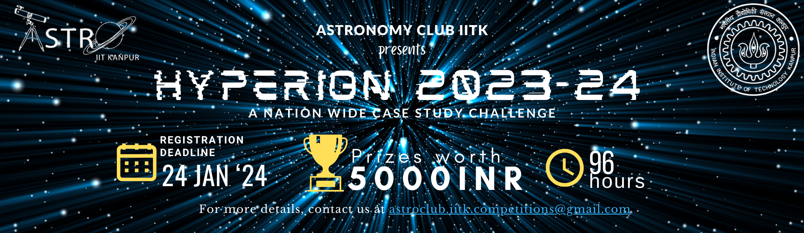

# Hyperion-2023



## Introduction

A case study challenge conducted by Astronomy Club (<a href="https://github.com/astroclubiitk">@astroclubiitk</a>), IIT Kanpur conducted on 25th - 28th January 2024.

## General Information

```
- The details of the challenge can be found in the Documents folder
- The data to be used for analysis can be found in the Data folder
```

## Team Members

### Coordinators
```
- Abhinav Singhal
- Princy Chauhan
- Shrilakshmi S K
```

### Secretaries involved
```
- Amar Sathwik
- Astitva
- Nilay Agarwal
- Samhitha
- Shivam Lal
```

## COSMOS IS WITHIN US!
